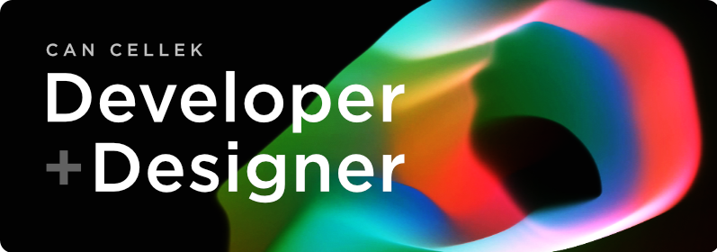

    

<h2 align="center">Hey There!</h2>

I am Can, a creative who blends technical expertise with artistic vision. My passion for game development and R&D projects has led me on a journey through various industries, from animation to game development, where I have honed my multidisciplinary skills from game engines and 3D modeling software, to programming languages and animation tools. I am always on the lookout for new and innovative ways to enhance my craft.

If you're interested in learning more about the tools and software I use, head over to my  <a href="https://cancellek.com/uses" target="_blank" rel="noopener noreferrer">uses</a> page, where I share my preferred tools and software.

    
    
     
    

  
    
    

    
     
     
    
    
    
    
    

 

    
    
    
    

    
    
    
     
    
    

